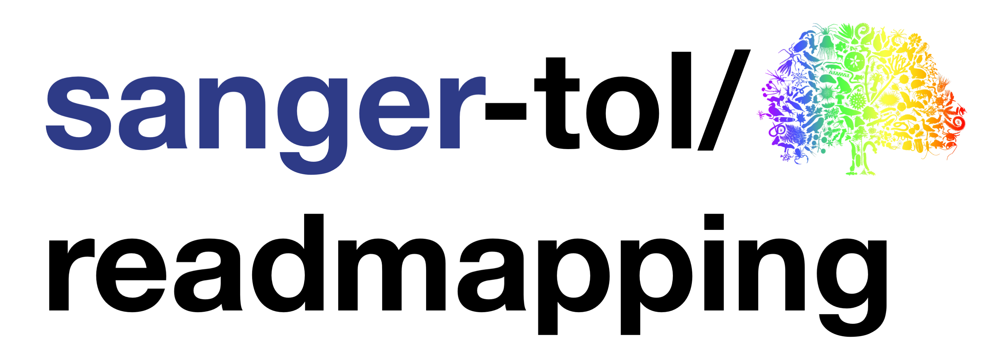

# 

[](https://doi.org/10.5281/zenodo.6563577)

[](https://www.nextflow.io/)
[](https://docs.conda.io/en/latest/)
[](https://www.docker.com/)
[](https://sylabs.io/docs/)
[](https://cloud.seqera.io/launch?pipeline=https://github.com/nf-core/readmapping)

[](https://nfcore.slack.com/channels/readmapping)[](https://twitter.com/nf_core)[](https://mstdn.science/@nf_core)[](https://www.youtube.com/c/nf-core)

## Introduction

**sanger-tol/readmapping** is a bioinformatics best-practice analysis pipeline for mapping reads generated using Illumina, HiC, PacBio and Nanopore technologies against a genome assembly.

The pipeline is built using [Nextflow](https://www.nextflow.io), a workflow tool to run tasks across multiple compute infrastructures in a very portable manner. It uses Docker/Singularity containers making installation trivial and results highly reproducible. The [Nextflow DSL2](https://www.nextflow.io/docs/latest/dsl2.html) implementation of this pipeline uses one container per process which makes it much easier to maintain and update software dependencies. Where possible, these processes have been submitted to and installed from [nf-core/modules](https://github.com/nf-core/modules) in order to make them available to all nf-core pipelines, and to everyone within the Nextflow community!

On merge to `dev` and `main` branch, automated continuous integration tests run the pipeline on a full-sized dataset on the Wellcome Sanger Institute HPC farm using the Nextflow Tower infrastructure. This ensures that the pipeline runs on full sized datasets, has sensible resource allocation defaults set to run on real-world datasets, and permits the persistent storage of results to benchmark between pipeline releases and other analysis sources.

## Pipeline summary


> [!NOTE]
> If you are new to Nextflow and nf-core, please refer to [this page](https://nf-co.re/docs/usage/installation) on how to set-up Nextflow. Make sure to [test your setup](https://nf-co.re/docs/usage/introduction#how-to-run-a-pipeline) with `-profile test` before running the workflow on actual data.

<!-- TODO nf-core: Describe the minimum required steps to execute the pipeline, e.g. how to prepare samplesheets.
     Explain what rows and columns represent. For instance (please edit as appropriate):

First, prepare a samplesheet with your input data that looks as follows:

`samplesheet.csv`:

```csv
sample,fastq_1,fastq_2
CONTROL_REP1,AEG588A1_S1_L002_R1_001.fastq.gz,AEG588A1_S1_L002_R2_001.fastq.gz
```

Each row represents a fastq file (single-end) or a pair of fastq files (paired end).

-->

4. Start running your own analysis!

   ```bash
   nextflow run sanger-tol/readmapping --input samplesheet.csv --fasta genome.fa.gz --outdir <OUTDIR> -profile <docker/singularity/podman/shifter/charliecloud/conda/institute>
   ```

## Credits

sanger-tol/readmapping was originally written by [Priyanka Surana](https://github.com/priyanka-surana).

We thank the following people for their extensive assistance in the development of this pipeline:

- [Matthieu Muffato](https://github.com/muffato) for the text logo
- [Guoying Qi](https://github.com/gq1) for being able to run tests using Nf-Tower and the Sanger HPC farm

## Contributions and Support

If you would like to contribute to this pipeline, please see the [contributing guidelines](.github/CONTRIBUTING.md).

For further information or help, don't hesitate to get in touch on the [Slack `#pipelines` channel](https://sangertreeoflife.slack.com/channels/pipelines). Please [create an issue](https://github.com/sanger-tol/readmapping/issues/new/choose) on GitHub if you are not on the Sanger slack channel.

## Citations

If you use sanger-tol/readmapping for your analysis, please cite it using the following doi: [10.5281/zenodo.6563577](https://doi.org/10.5281/zenodo.6563577)

An extensive list of references for the tools used by the pipeline can be found in the [`CITATIONS.md`](CITATIONS.md) file.

You can cite the `nf-core` publication as follows:

> **The nf-core framework for community-curated bioinformatics pipelines.**
>
> Philip Ewels, Alexander Peltzer, Sven Fillinger, Harshil Patel, Johannes Alneberg, Andreas Wilm, Maxime Ulysse Garcia, Paolo Di Tommaso & Sven Nahnsen.
>
> _Nat Biotechnol._ 2020 Feb 13. doi: [10.1038/s41587-020-0439-x](https://dx.doi.org/10.1038/s41587-020-0439-x).
